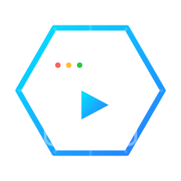
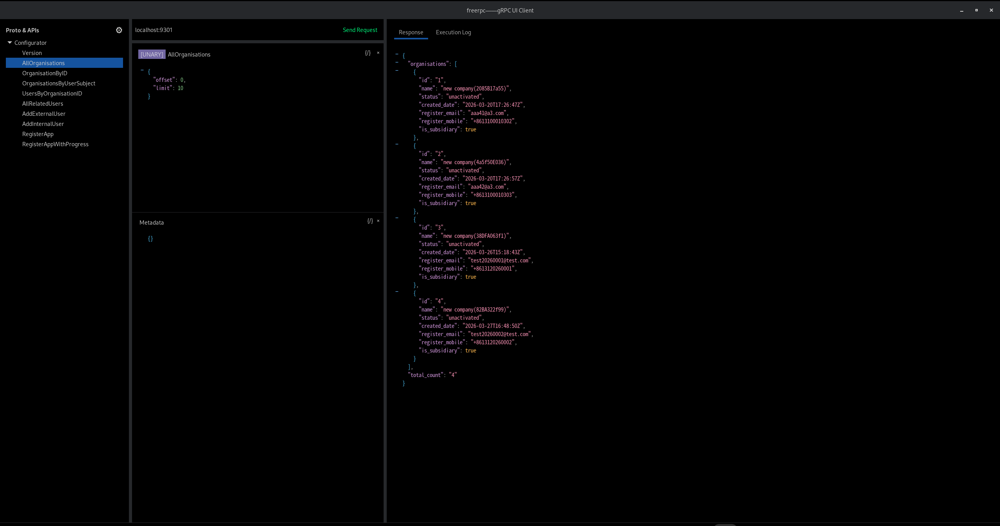
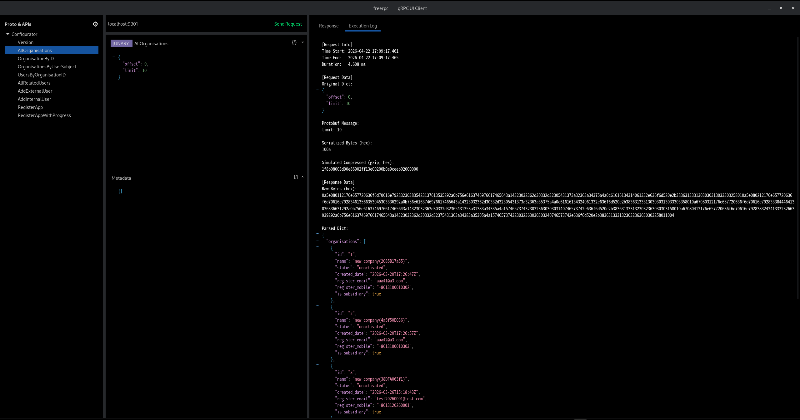

# FreeRPC



A lightweight **gRPC client GUI tool** built with **Python 3 + GTK4 (PyGObject)**.
FreeRPC is inspired by BloomRPC and focuses on simplicity, clarity, and extensibility.

---

## ✨ Overview

FreeRPC provides a clean and intuitive interface for exploring gRPC services, composing requests, and inspecting responses.
It is designed for developers who want a fast, minimal, and customizable alternative to heavier API tools.

---

## 📸 Screenshots

### Request & Response Panels



### Execution Log Panel



---

## 🚀 Features

* 🧩 Proto-based API navigation (left panel)
* ✍️ Editable JSON request & metadata
* 📡 gRPC request execution with detailed logging
* 📊 Structured response visualization
* 🎨 GTK4-based UI with custom CSS styling
* 🪶 Lightweight and fast startup
* 🔧 Easily extensible architecture

---

## 🏗️ Project Structure

```yaml
main.py: Entry point

app:
  __init__.py:
  app.py: Application initialization

context:
  app_context.py: Global context (currently holds configuration)

ui:
  __init__.py:
  main_window.py: Main window
  header_bar.py: Top toolbar
  left_panel.py: Left panel (Proto + APIs)
  center_panel.py: Center panel (Request editor)
  right_panel.py: Right panel (Response viewer)
  json_tree.py: JSON tree view (navigation)
  editable_json_tree.py: Editable JSON component (request & metadata)

handlers:
  __init__.py:
  toolbar_handler.py: Toolbar events
  api_handler.py: API click handling
  left_panel_handler.py: Left panel interactions
  center_panel_handler.py: Center panel interactions

services:
  __init__.py:
  grpc_service.py: gRPC invocation layer
  proto_service.py: Proto parsing layer

styles:
  style.css: GTK styling

utils:
  __init__.py:
  json_utils.py: JSON formatting utilities
  config_manager.py: Configuration manager
```

---

## 🧠 Design Philosophy

FreeRPC emphasizes:

* **Clarity over complexity** – a clean UI with minimal distractions
* **Separation of concerns** – clear division between UI, handlers, and services
* **Extensibility** – easy to plug in new features (e.g., dynamic gRPC calls, proto parsing)
* **Developer-first experience** – built by developers, for developers

---

## ⚙️ Tech Stack

* **Python 3**
* **GTK4 (PyGObject)**
* **gRPC / Protobuf**
* Custom CSS styling for UI refinement

---

## 📌 Notes

* The project is actively evolving, especially around dynamic gRPC invocation and debugging capabilities.

---

## 📄 License

MIT License (or customize as needed)

---

If you’re looking for a simple, hackable gRPC GUI client with a native desktop feel, FreeRPC aims to be exactly that.
